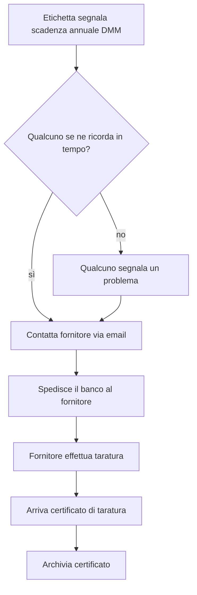
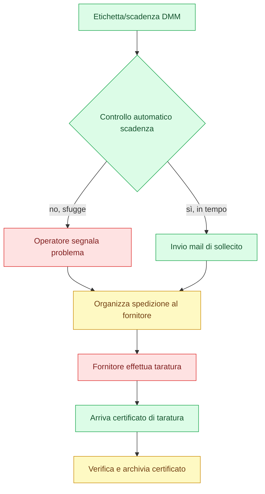

# Analisi di processo — Manutenzione annuale DMM (banchi)

## Processo mappato

Controllo/monitoraggio periodico delle attrezzature, focalizzato sul caso specifico dei **banchi che montano DMM con scadenza di manutenzione/taratura annuale**.

- **Chi lo fa:** Industrializzazione
- **Trigger attuale:** etichetta fisica sul banco che segnala la scadenza annuale
- **Fine processo:** certificato di taratura ricevuto e archiviato

## Situazione attuale (as-is)

Non esiste un piano di manutenzione strutturato: si agisce prevalentemente in modo reattivo (quando qualcosa si rompe). Per i DMM esiste un'etichetta con la scadenza, ma non tutti se ne ricordano — manca un sistema di promemoria.

## Diagramma di flusso — stato attuale

**Criticità principale:** il ramo "no" — se nessuno se ne ricorda in tempo, il banco continua a essere usato scaduto finché qualcuno non segnala un problema.

## Analisi passo-passo

| Passo | Tipo | Note |
|---|---|---|
| Controllare la data di scadenza | Esecuzione pura | Automatizzabile |
| Mandare mail di sollecito | Esecuzione pura | Automatizzabile |
| Organizzare spedizione al fornitore | Esecuzione + coordinamento | Assistibile da AI, conferma umana |
| Taratura del banco | Competenza tecnica esterna | Resta umano (fornitore) |
| Verificare e archiviare il certificato | Esecuzione + giudizio | Assistibile da AI, verifica umana |
| Segnalazione problema da operatore | Sintomo del gap | Non automatizzabile — dovrebbe sparire risolvendo il resto |

**Impatto di un errore** sui passi automatizzabili (controllo data, invio sollecito): **fastidio**, non costo né disastro — rischio basso, buon candidato per partire.

## Mappa dell'automazione

**Legenda**
- **Verde — automatizzabile ora:** controllo scadenza e invio sollecito. Pura esecuzione, dati strutturati, errore al massimo fastidioso.
- **Giallo — AI con revisione umana:** organizzare la spedizione (bozza email/coordinamento) e archiviare il certificato (estrazione dati, verifica prima di chiudere).
- **Rosso — resta umano:** la taratura la esegue il fornitore esterno (competenza tecnica); la segnalazione da operatore è un sintomo del problema attuale, non un passo da automatizzare — sparirebbe risolvendo il verde.

## Raccomandazione — progetto pilota

Partire dal nodo verde **"Controllo automatico scadenza → invio mail di sollecito"**: un sistema di reminder/calendario automatico sulle scadenze annuali dei DMM. Rischio basso, implementazione semplice, risolve direttamente il gap descritto (etichetta fisica + memoria umana → nessun sistema affidabile).

Fasi successive naturali: estendere il sistema a tutte le attrezzature con scadenze note (non solo DMM), poi collegarlo al modulo di monitoraggio/manutenzione predittiva più ampio descritto nel progetto della piattaforma di industrializzazione.
